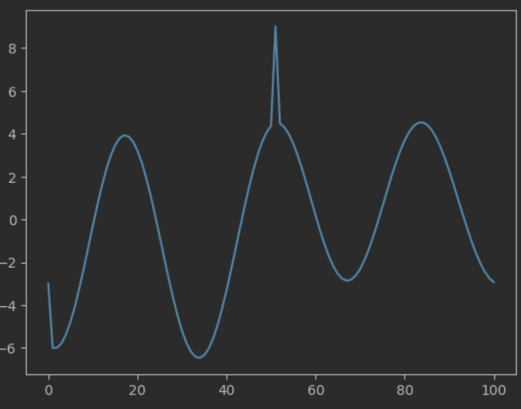
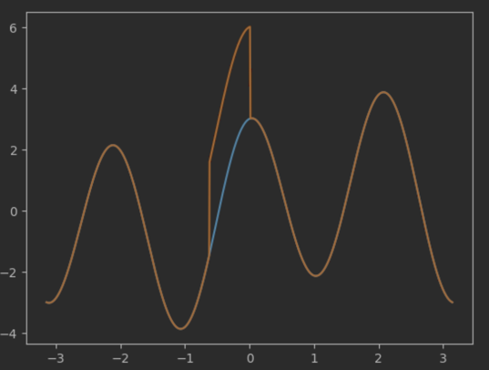

## 通道参考算法
1. 均匀选取像素点，JPEG Quality=99，wm strength=0.2
BER 11.5%, psnr 52 左右

#### FFmpeg usage & benchmark

```shell
ffmpeg -hide_banner \
  -i data/dst.mp4 -i data/wm_gray.png \
  -c:v h264_videotoolbox\
  -filter_complex "overlay=x=0:y=0" \
   -b:v 4M \
   data/out.mp4 -y

#ffplay -i data/out.mp4
```

## 改进 & 实验
* 选取出特征点后，将特征点 scale 到 8x8，加入 bit 后无损 scale 到原始大小，以求尺度不变性
  * 最终得到结果，发现不如拆分为 8x8 的效果好
  *  大多数嵌入的水印都会给图像造成类似尖峰脉冲的影响，这种影响在当 scale 倍数大于 2 倍时将越来越明显。
  * 最终导致整体图片都被提升一个亮度级，例如下图展示了 bilinear 下将 1024 大小的函数转到大小为 10 后对其中一个分量进行操作导致的结果：
  * 

